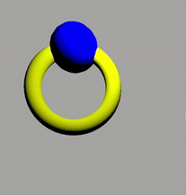

# test-threejs-with-node

This project demonstrates a basic 3D scene created with **Three.js** and **Node.js**. The scene includes a sphere and a torus (doughnut shape), set against a background, illuminated by spot lighting, and includes basic camera controls. This setup uses **Vite** as the development server for faster bundling and optimized builds.

## Project Demo



## Project Features

- **Three.js**: 3D library to create and animate WebGL content.
- **OrbitControls**: Allows panning, rotating, and zooming of the camera.
- **Basic Scene**: Contains a sphere and a torus, with materials, lighting, and background color.
- **Vite**: Used as a fast, lightweight development server.

## Installation

1. Clone the repository:

   ```bash
   git clone https://github.com/SaadiaEl08/test-threejs-with-node.git
   ```

2. Navigate to the project directory:

   ```bash
   cd test-threejs-with-node
   ```

3. Install dependencies:

   ```bash
   npm install
   ```

## Usage

1. Start the development server:

   ```bash
   npm run dev
   ```

2. Open your browser and go to the local server URL.

3. You should see a 3D scene containing a blue sphere and a yellow torus, with interactive camera controls to rotate and zoom in/out.

## Code Structure

- **Scene**: Initialized with `THREE.Scene()` and a gray background.
- **Camera**: Perspective camera with a 70-degree field of view.
- **Objects**:
  - **Sphere**: Positioned at `(-1, 2, 0)` with a blue color.
  - **Torus (Donut)**: Positioned at `(-1, 1, 0)` with a yellow color.
- **Light**: A white `SpotLight` illuminating the objects.
- **Renderer**: `WebGLRenderer` with window size and pixel ratio settings.
- **Controls**: `OrbitControls` allows users to rotate, zoom, and pan the scene.
- **Animation**: Updates the torus rotation and refreshes the render.
- **Responsive**: Updates the camera aspect and the renderer position to make the scene responsive.

## Dependencies

- [Three.js](https://threejs.org/) - WebGL library for rendering 3D graphics.
- [Vite](https://vitejs.dev/) - Build tool for frontend projects.

```

